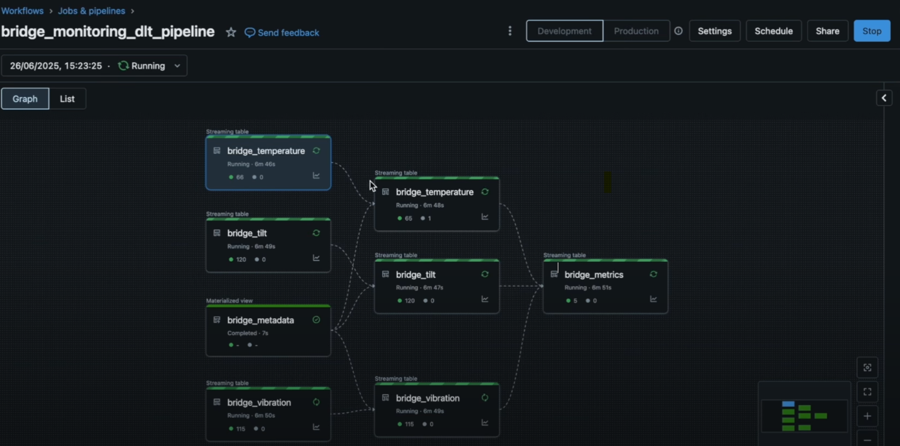
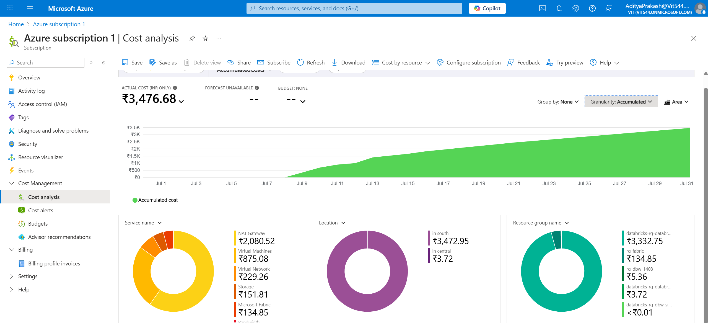
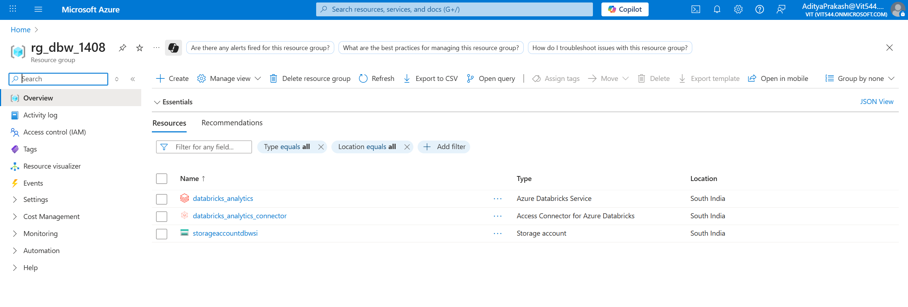
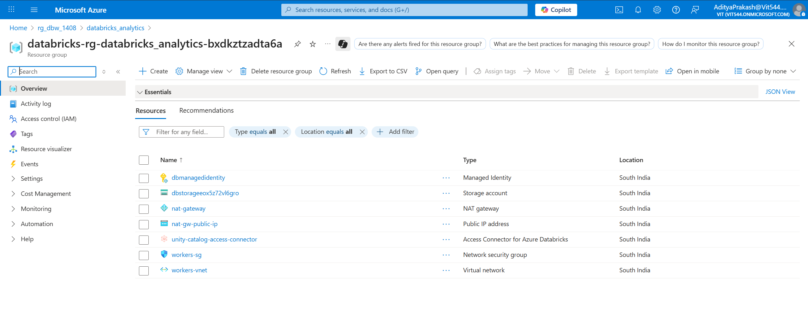

# Data Pipeline for Structural Health Monitoring

A hands-on demo of a production-grade streaming ETL pipeline using Databricks Delta Live Tables (DLT). We simulate IoT sensors on major bridges, ingest three raw streams (temperature, vibration, tilt), enrich them with static metadata, and compute 10-minute windowed metrics via watermarks, window aggregations, stream-static joins, and stream-stream joins.

---

## Repository Structure

- **queries.sql**  
  Contains ad hoc SQL queries to explore and validate the Delta Live Tables (DLT) output across all layers

- **00_data_generator.ipynb**  
  Defines `generate_stream()`: continuously emits synthetic sensor readings into Delta paths, one minute apart, with a small random timestamp lag to mimic real-world delays.

- **01_bronze_processing.ipynb**  
  Bronze layer: three streaming tables (`01_bronze.bridge_temperature`, `01_bronze.bridge_vibration`, `01_bronze.bridge_tilt`) that read raw Delta files as soon as they arrive.

- **02_silver_processing.ipynb**  
  Silver layer:  
  - `02_silver.bridge_metadata`: static lookup of five European bridges.  
  - Three enriched streaming tables that join each Bronze stream to the static metadata and enforce data-quality expectations.

- **03_gold_processing.ipynb**  
  Gold layer:  
  - Reads the three silver streams with a 2-minute watermark.  
  - Computes 10-minute tumbling aggregates:  
    - **avg_temperature**  
    - **max_vibration**  
    - **max_tilt_angle**  
  - Joins them by `(bridge_id, window_start, window_end)` into `03_gold.bridge_metrics`.

---

## Unity Catalog Structure
- Create a managed catalog called `bridge_monitoring`
- Create schemas in the catßalog called `00_landing`, `01_bronze`, `02_silver` and `03_gold`
- Create a managed volume in the `00_landing` schema called `streaming`
- In the `streaming` volume create three subdirectories called `bridge_temperature`, `bridge_vibration` and `bridge_tilt`

---

## Step 1: Simulate Sensor Data

1. Open **00_data_generator.ipynb**.  
2. Provide your Delta paths in the `streams` list.  
3. Run the notebook; it will spin up three background generators that append new data every minute, with a random 0–60 s timestamp lag.

---

## Step 2: Bronze Ingestion

1. Create a new DLT pipeline in Databricks, attaching **01_bronze_processing.ipynb** as a notebook source.  
2. Configure the pipeline to use your Unity Catalog schema (e.g. `bridge_monitoring.bronze`).  
3. Run—three streaming tables will appear, capturing raw temperature, vibration, and tilt events.

---

## Step 3: Silver Enrichment

1. Add **02_silver_processing.ipynb** to the same pipeline.  
2. Ensure the schema names are `bridge_monitoring.silver`.  
3. Run—DLT will materialize:  
   - `bridge_metadata` (static)  
   - Three enriched streams with `@dlt.expect_or_drop` checks and stream–static joins.

---

## Step 4: Gold Aggregation & Joins

1. Add **03_gold_processing.ipynb** to your pipeline.  
2. Verify the target schema `bridge_monitoring.gold`.  
3. Run—DLT will:  
   - Apply 2-min watermarks  
   - Compute 10-min tumbling avg/max metrics  
   - Perform stream–stream joins on window bounds  
   - Publish `bridge_metrics` for downstream analytics.

---

## What You’ll Learn

- **DLT Architecture**: Bronze→Silver→Gold medallion pattern  
- **Declarative Pipelines**: `@dlt.table`, `@dlt.expect_or_warn`, `dlt.read_stream` vs `dlt.read`  
- **Streaming Concepts**: watermarks, window aggregations, stream–static and stream–stream joins  
- **Incremental Processing**: how DLT only processes new data and handles retries automatically  

---

## Also Demontstrated

- Extend to more sensor metrics (e.g. tilt rate, strain gauges)  
- Add alerts with DLT expectations or Databricks SQL  
- Integrate with a real-time dashboard (e.g. Databricks SQL or Power BI)  

